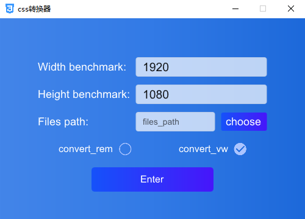

# 📐 CSS Unit Converter | CSS 单位转换工具

## 🌟 Features | 核心功能

**Convert px to rem or vw/vh by parsing CSS files**  
**解析 CSS 文件，实现 px 与 rem/vw/vh 单位转换**



---

## 🚀 Quick Start | 快速开始

### Prerequisites | 环境要求

| Category       | Technology   | Version   |
| -------------- | ------------ | --------- |
| **Language**   | Rust         | `1.85+`   |
| **GUI**        | Slint        | `1.10.0+` |
| **CSS Parser** | LightningCSS | `1.0.0+`  |

### Installation | 安装步骤

```bash
# Clone repository
git clone https://github.com/xjy12345654/css_parser.git
cd css_parser

# Build and run
cargo run

# Build optimized release
cargo build --release

```

## 🛠 Configuration | 配置说明

### 📂 File Naming Convention | 文件命名规则

| Pattern          | Behavior                | 说明            |
| ---------------- | ---------------------   | --------------- |
| `.css`           | Skip rem/vw conversion  | 跳过 rem/vw 转换|
| `*_conv_rem.css` | Skip rem conversion     | 跳过 rem 转换   |
| `*_conv_vw.css`  | Skip vw/vh conversion   | 跳过 vw/vh 转换 |

---

### ✨ Special Syntax | 特殊语法

```css
/* Explicit vh unit specification | 显式指定 vh 单位 */
.element {
  width: 160px;   /* Auto-convert to vw  | 自动转换为 vw */
  height: vh(60); /* convert to vh       | 转换为 vh */
  margin: 12px;   /*  Auto-convert to vw | 自动转换为 vw */
}
```

## ⚠️ Notes | 注意事项
### 📱 Media Query Handling | 媒体查询规则
```css
/* 
The px unit will remain unchanged within the parentheses of media queries.
px 单位在 media queries 的括号内将保持不变
*/
@media screen and (max-width: 300px) {
  /**  Continue to convert */
  .box {...}
}

```
###  1px Special Cases | 1px 处理规则
```css
 .box {
    border: 1px solid #000; /* 🚫 No conversion | 不进行单位转换 */
  }
/* 
Absolute Values
绝对值处理
1px values are preserved by default
默认保留 1px 绝对值
*/
```


## 🗂 Project Structure | 项目结构

```bash
css_parser/
├── src/                # 🦀 Rust source code | Rust 源代码
│   ├── lib.rs          # 🧠 Core conversion logic | 核心转换逻辑
│   └── app.rs          # 🖥️ UI callback handlers | UI 回调处理器
├── ui/                 # 🎨 Slint GUI designs | GUI 设计文件
│   ├── app-window.slint# 🪟 Main application window | 主窗口文件
│   ├── components/     # 🧩 Reusable UI components | 可复用组件
│   ├── psd/            # 📐 Design source files | 设计源文件
│   └── images/         # 🖼️ UI assets | 界面素材
├── build.rs            # 🔨 Build script | 构建脚本
└── Cargo.toml          # 📦 Dependencies config | 依赖配置
```


